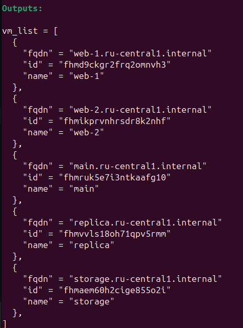
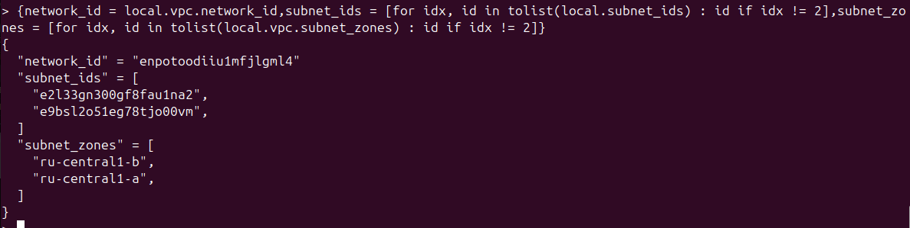
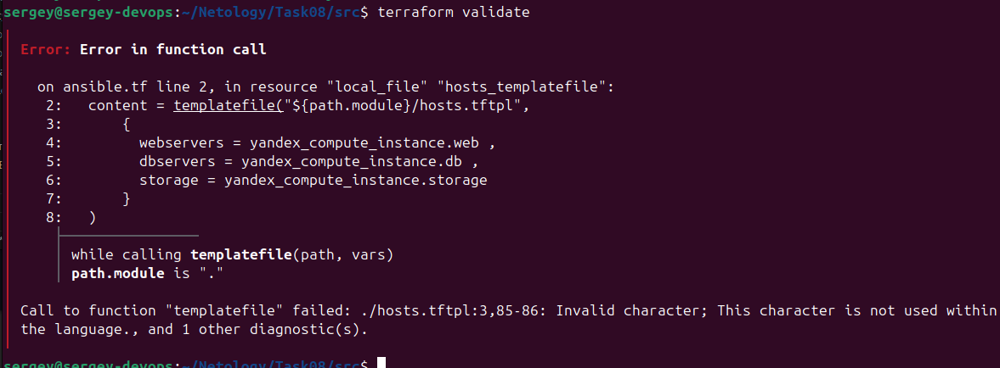
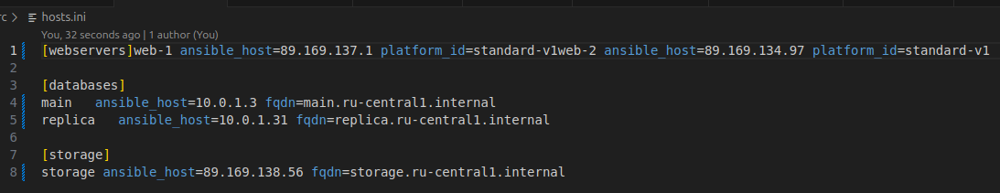

[Задание](https://github.com/netology-code/ter-homeworks/blob/main/03/hw-03.md)

## [Задание 1](tasks/task1.md)
[Source](src1/) (из копии https://github.com/netology-code/ter-homeworks/tree/main/03/src)

Меняем в providers настройки на доступ по ключу вместо токена:  


Инициализируем `terraform init`  
Выполняем `terraform apply`

Доступ к группам безопасности есть:  


Входящие правила:


## [Задание 2](tasks/task2.md)
[Source](src2/)

Создаём файл [count_vm.tf](https://terraform-provider.yandexcloud.net/Resources/compute_instance) по `yandex_compute_instance`

Добавляем переменные в [variables.tf](src/variables.tf)

Создаём файл [data.tf](src/data.tf) с образом для создаваемых машин

Добавляем группы безопасности  


Создаём файл [for_each-vm.tf](src/for_each-vm.tf)

Добавляем локальную переменную для for_each файла:  


Виртуальные машины создались:  


## [Задание 3](tasks/task3.md)

Создаём файл [disk_vm.tf](src/disk_vm.tf)

Запускаем, проверяем:  


[Commit](https://github.com/SergueiMoscow/DevOps-Terraform-03/commit/44cea5541b9a5ea7e37a81cd2f84550d463795ca)

## [Задание 4](tasks/task4.md)

Примеры берём из кода урока

Создаём [ansible.tf](src/ansible.tf)  
Не стал удалять примеры создания for.ini и hosts.yaml, их тоже адаптировал под проект.

Создаём [hosts.tftpl](src/hosts.tftpl), модифицируем, добавляя fqdn

Получившийся [hosts.ini](src/hosts.ini)


[Commit](https://github.com/SergueiMoscow/DevOps-Terraform-03/commit/1dc9fa826e313f4d77cd6612248aaf760a543c0c)

## [Задание 5](tasks/task5.md)

Пишем [output.tf](src/output.tf)

Запускаем `terraform apply`.

Output:  


[Commit](https://github.com/SergueiMoscow/DevOps-Terraform-03/commit/049f63b60263a5578777cde5e344aa105fae58b0)

## [Задание 6](tasks/task6.md)

Копируем `ansible.tf` из урока в [`ansible_exec`](src/ansible_exec.tf)

Определяем параметры nat и preemptible для БД, nat ставим false  


Модифицируем `hosts.tftpl`  


Запускаем, результат:


[Commit](https://github.com/SergueiMoscow/DevOps-Terraform-03/commit/88b05f9b4e5fa21dac6bd935dcc7b69aa04009b2)

[Commit со сгенерированными by ansible.tf файлами](https://github.com/SergueiMoscow/DevOps-Terraform-03/commit/847be9e624996bd9b746ffbd2ae56edc546467a7)

## [Задание 7](tasks/task7.md)

Создаём [vpc.tf](src/vpc.tf) с объявлением необходимых данных.

Конструкция для удаления элемента из переменной:  
`[for idx, id in tolist(local.subnet_ids) : id if idx != 2]`

Результат:  


[Commit](https://github.com/SergueiMoscow/DevOps-Terraform-03/commit/7a27edfa67d9cff955305a2c19cd9fddf3365c09)

Конструкция, из которой получаем всю структуру без третьих элементов:
```
{
  network_id = local.vpc.network_id
  subnet_ids = [for idx, id in tolist(local.subnet_ids) : id if idx != 2]
  subnet_zones = [for idx, id in tolist(local.vpc.subnet_zones) : id if idx != 2]
}
```

Она же в одну строку (для copy-paste непостердсвенно в консоль terraform):
`{network_id = local.vpc.network_id,subnet_ids = [for idx, id in tolist(local.subnet_ids) : id if idx != 2],subnet_zones = [for idx, id in tolist(local.vpc.subnet_zones) : id if idx != 2]}`



## [Задание 8](tasks/task8.md)

В данном коде:  
```
[webservers]
%{~ for i in webservers ~}
${i["name"]} ansible_host=${i["network_interface"][0]["nat_ip_address"] platform_id=${i["platform_id "]}}
%{~ endfor ~}
```
лишний не там стои закрывающая фигурная скобка. Вот ошибка `terraform validate`  


Исправляем, также убираем лишний пробел в строке `"platform_id "`:  
`${i["name"]} ansible_host=${i["network_interface"][0]["nat_ip_address"]} platform_id=${i["platform_id"]}`

Выполняем:
Результат (hosts.ini):  


[Commit](https://github.com/SergueiMoscow/DevOps-Terraform-03/commit/182d2aec89d38426f022d4a27d10a75f32afb764)

